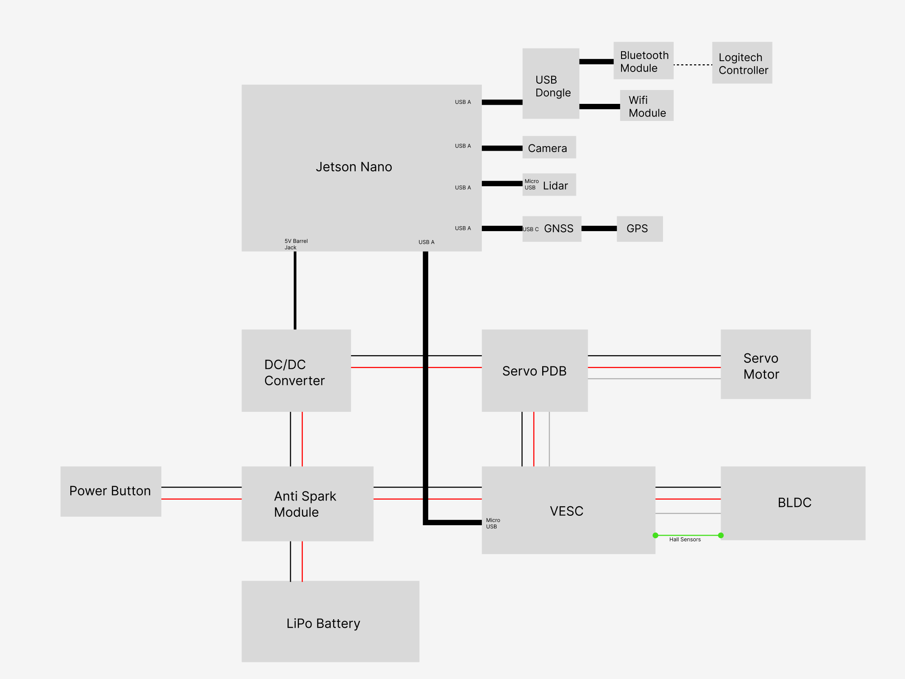

# Mechanics and Electronics 

Excecuting a great final project wasn't just implementing pose estimation, it also meant a neat fit and finish and sleek design that would make our robot stand out.
<video controls>
  <source src="../../static/img/148CARASSEMBLY.mp4" type="video/mp4"/>
  Video Unsupported by Browser
</video>

## Electronics
The first step of this was sourcing and wiring the all the electronic hardware that would power our bot. Powering our robot is an NVidia jetson Nano and Flipsky FSESC V6, a VESC based speed controller. The mechanical base of our bot was a TRAXXAS Slash 1/10 scale RC truck. For sensors, we utilized an OAK-D camera with RGBD capablitiies, an LD06 2D lidar, a Ublox GNSS board, and course we needed some miscellaneous components such as Wifi adapters, Buck converters, and a servo power distribution board. You can see below the wiring diagram of our robot:

Early on we could tell that cable management would be one of the biggest struggles we would face because packaging so many components into a relatively small chassis would usually call for custom wiring, however in most cases we were limited to the wiring harnesses provided to us by the class. To combat this, each iteration of our design incorporated more cable management options such as pass-through points, tie down locations, or purpose-built channels in the robot for specific wires. 

## Mechanical Design

Starting with a COTS chassis from TRAXXAS has its benefits, but it needed extensive modification before it would be useful for our purposes. Stripping off the livery and decorative body of an RC truck reveals a barebones chassis like this:
 

Which, luckily, is a great modular base for robots like ours. Using a multi-tiered approach, we were able to package all of our electronics and wiring inside our body, leaving a very clean finish. The body is made with a mix of laser cut 4mm black acrylic and ABS printed on the Prusa Mk.4 Minis availble at the UCSD Design and Innovation Building Makerspace. All metric hardware was used, a mix of m2 and m4 bolts, with the only glued component being the decorative spoiler which was acylic solvent welded. The goal for the design was not only to be extremly compact and look good, but also not hinder the functionality and serviceability of the robot as much as possible. In order to retain quick access to the battery, the side skirts were designed to press fit into place, allowing us to change batteries without needing any tools during our testing. Earlier iterations did, and we quickly found that constantly unblolting components was a headache and overly time consuming. 
<video controls>
  <source src="../../static/img/Assembly_2024-Dec-15_06-12-27AM-000_CustomizedView11119014967_mp4 copy.mp4" type = "video/mp4"/>
  Video Unsupported by Browser
</video>

The Jetson Nano is held in a modified case based a generic model found online, but it was designed to be mounted to maximize airflow and allow the wires to be passed underneath the case dirctly to the sensors and VESC housed below. By thuroughly enclosing our electronics, we were confindently able to push the limits of our robot in testing, and even when the truck rolled or was driven into brick walls, the electronics stayed safe and sound inside.

However, all this plastic did have a significant impact on the stance of the robot. We noticed that our ground clearance was so low that on tight turns, the bottom of our chassis would scrape the ground. We began to get concerned about bottoming out when driving over obstacles, so we installed new shocks designed for a much larger scale RC truck which gave us nearly 2 inches of clearance without overly affecting our roll center. The before and after is pretty shocking! (Get it??) Unfortunetaly, these high-strength shocks caused some difficulty with our steering, as the low-power servo motor struggled with full steer due to the resistive force of the shocks. It ended up being a huge problem when we were trying to tune our PID for GNSS navigation, so We ended up finding shorter shocks that didn't have as much pre-compression, which rectified the problems we experienced. 
 Hardly any ground clearance:           |  First-replacement
:-------------------------:|:-------------------------:
  |  

Obviously, the spoiler was just for fun, but it really turned out great so we decided to keep it on and it ended up being one of our favorite parts of the car, all starting from a jokingly asked, "You know what this thing needs?" after a long workday. 